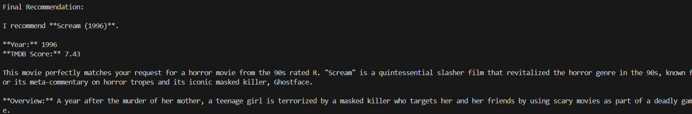

# Movie Recommendation ReAct Agent

This project implements a **ReAct (Reasoning + Acting) AI Agent** for movie recommendations using **LangChain**, **Google Gemini**, and the **TMDB API**.

The agent is also evaluated using the **DeepEval framework** to measure the quality of its movie recommendations and verify whether the generated responses satisfy user constraints such as genre, release period, and certification.

## Demo



## Overview

This project implements a **ReAct (Reasoning + Acting) Agent** using **LangChain** and **Google Gemini**.

Instead of returning hardcoded movie recommendations, the agent:

1. Understands the user's request.
2. Extracts movie constraints such as genre, release period, and certification.
3. Calls a live TMDB API tool.
4. Retrieves fresh movie data.
5. Analyzes the returned results.
6. Generates a recommendation based on the results.

The project also includes an evaluation suite built using **DeepEval**. The evaluation tests run the actual agent against multiple movie recommendation requests and use a Gemini-powered `GEval` metric to assess recommendation quality and constraint satisfaction.

### Example

User Request:

```text
Recommend a horror movie from the 90s rated R
```

Agent Reasoning:

* Horror → Genre filter
* 90s → Release years 1990–1999
* R → Certification filter

Tool Call:

```json
{
  "genre": "horror",
  "start_year": 1990,
  "end_year": 1999,
  "certification": "R"
}
```

The recommendation is generated using live TMDB data.

---

# Project Structure

```text
movie-react-agent/
│
├── assets/
│   └── demo.png
│
├── evals/
│   ├── __init__.py
│   ├── test_agent.py
│   └── test_cases.py
│
├── main.py
├── tmdb_tool.py
├── requirements.txt
├── .env
└── README.md
```

### File Description

| File                  | Purpose                                                       |
| --------------------- | ------------------------------------------------------------- |
| `main.py`             | Creates and runs the ReAct agent                              |
| `tmdb_tool.py`        | TMDB API tool used by the agent                               |
| `evals/test_agent.py` | DeepEval evaluation logic and metrics                         |
| `evals/test_cases.py` | Evaluation dataset containing movie recommendation test cases |
| `evals/__init__.py`   | Marks the evaluation directory as a Python package            |
| `requirements.txt`    | Project dependencies                                          |
| `.env`                | API keys                                                      |
| `README.md`           | Project documentation                                         |

---

# Prerequisites

* Python 3.12
* Google Gemini API Key
* TMDB API Key
* VS Code (recommended)

---

# Create Python 3.12 Virtual Environment

Verify Python 3.12:

```powershell
py -3.12 --version
```

Create a virtual environment:

```bash
py -3.12 -m venv venv
```

Activate it on Windows:

```powershell
venv\Scripts\Activate.ps1
```

You should see:

```text
(venv)
```

in your terminal.

---

# Install Dependencies

Install all required dependencies:

```bash
pip install -r requirements.txt
```

The project uses DeepEval and the Google Gen AI SDK for evaluation in addition to the dependencies required by the movie recommendation agent.

---

# Environment Variables

Create a `.env` file in the project root:

```env
GOOGLE_API_KEY=your_gemini_api_key
TMDB_API_KEY=your_tmdb_api_key
```

The Gemini API key is used by the ReAct agent and the DeepEval evaluation model.

Do not commit the `.env` file or expose real API keys in the repository.

---

# Running the Project

Start the agent:

```bash
python main.py
```

Example:

```text
Enter your request:

Recommend a horror movie from the 90s rated R
```

The agent will analyze the request, call the TMDB tool, retrieve matching movies, and recommend one movie that satisfies the requested constraints.

---

# Example ReAct Flow

```text
Question:
Recommend a horror movie from the 90s rated R

Thought:
Identify genre

Thought:
Identify year range

Thought:
Identify certification

Action:
movie_search_tool

Action Input:
{
  "genre": "horror",
  "start_year": 1990,
  "end_year": 1999,
  "certification": "R"
}

Observation:
Matching movies returned from TMDB

Thought:
Analyze results and choose the best recommendation

Final Answer:
Recommend one matching movie with its title, year, TMDB score,
reason for recommendation, and a short overview.
```

---

# Error Handling

The project includes handling for:

* Missing Gemini API key
* Missing TMDB API key
* Invalid JSON tool input
* Unsupported genres
* Invalid year ranges
* TMDB API errors
* Network timeouts
* No matching movies found

---

# Agent Evaluation with DeepEval

The AI agent is evaluated using the **DeepEval framework**.

The evaluation suite runs the real movie recommendation agent against multiple test cases and evaluates the quality of its responses using a Gemini-powered `GEval` metric.

The evaluation checks whether the agent:

* Provides a relevant movie recommendation.
* Follows the requested genre constraint.
* Follows the requested release year or decade constraint.
* Follows the requested certification constraint when provided.
* Clearly explains why the recommended movie matches the user's request.

The evaluation test cases cover different request patterns, including:

* Genre + decade + certification
* Genre + decade
* Different movie genres
* PG-13 certification constraints
* Explicit release year ranges

## Evaluation Files

The evaluation implementation is located in:

```text
evals/
├── __init__.py
├── test_agent.py
└── test_cases.py
```

`test_cases.py` contains the evaluation inputs and expected constraints.

`test_agent.py` runs the movie agent, creates DeepEval `LLMTestCase` objects, and evaluates the generated recommendations using the configured `GEval` metric.

## Run the Evaluations

Make sure the virtual environment is activated and both API keys are configured in `.env`.

From the project root, run:

```bash
deepeval test run evals/test_agent.py
```

DeepEval will:

1. Run each movie recommendation test case.
2. Send the input to the actual ReAct agent.
3. Collect the generated recommendation.
4. Evaluate the response using the configured Gemini evaluation model.
5. Calculate the evaluation score.
6. Mark the evaluation as passed or failed according to the configured threshold.

The evaluation uses a threshold of `0.7`. A score greater than or equal to the threshold is considered a passing evaluation.

> **Note:** Gemini API free-tier accounts have request limits. Running all evaluation cases may result in a `429 RESOURCE_EXHAUSTED` error if the API request quota is exceeded. This is an API quota limitation rather than an evaluation assertion failure. If this occurs, rerun the evaluations after the quota becomes available again.

---
